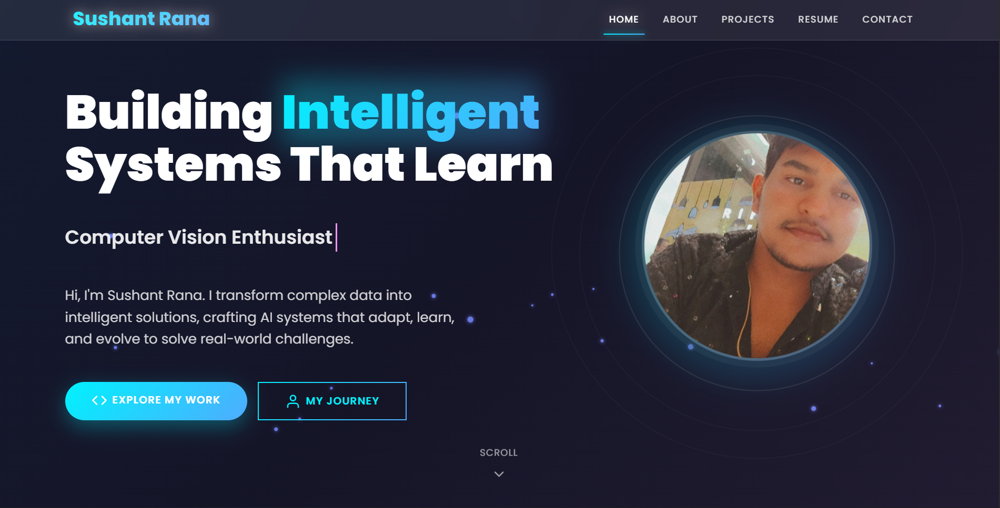
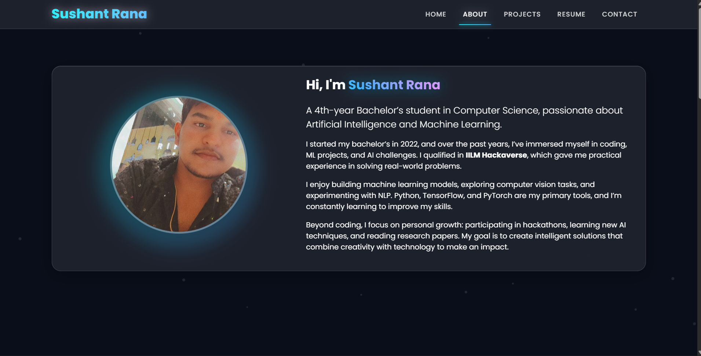
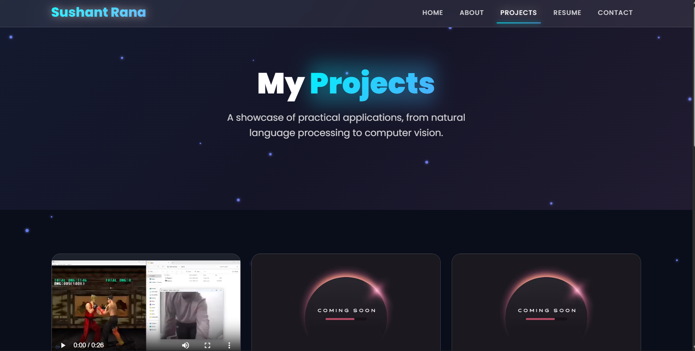
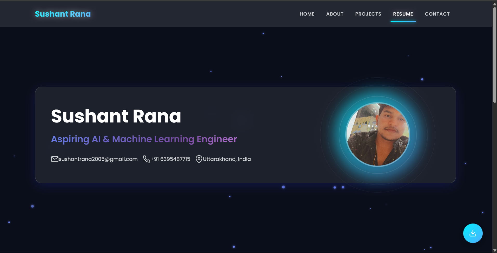
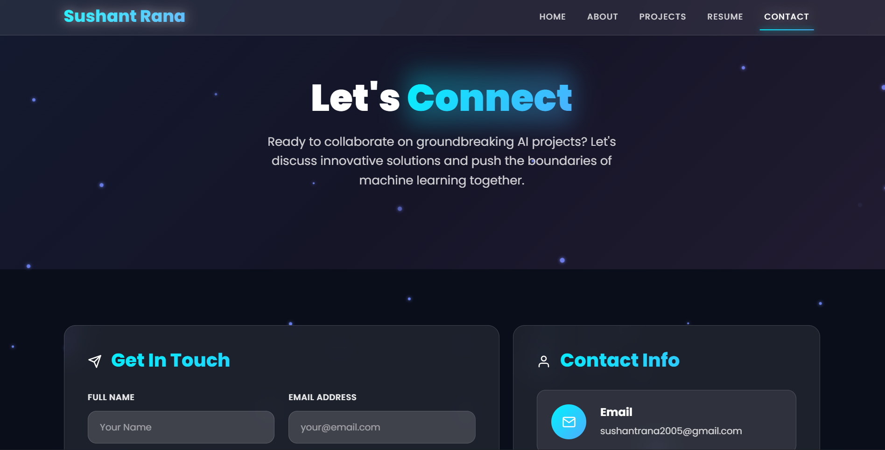

# 🌟 Sushant Rana – Portfolio

Welcome to my portfolio repository!  
This portfolio showcases my projects, skills, and experience as I build my career in **AI/ML, Data Science, and Software Development**.

---

## 🚀 Live Portfolio
🔗 **[View My Portfolio](https://imsushant2005.github.io/imsushant/)**  

---

## 🧑‍💻 About Me
Hi! I'm **Sushant Rana**, a passionate tech enthusiast specializing in:
- 🤖 **AI/ML Engineering** – Building intelligent solutions with deep learning and LLMs.
- 💻 **Full-Stack Development** – Creating responsive and modern web apps.
- 📊 **Data Science** – Turning data into actionable insights.

I love learning new technologies, solving real-world problems, and contributing to open-source projects.

---

## 🛠 Tech Stack
Here are some tools and technologies I work with:

- **Programming:** Python, JavaScript, C++
- **Frameworks:** Streamlit, Flask, React, Django
- **Machine Learning:** TensorFlow, PyTorch, Scikit-learn
- **Databases:** MySQL, MongoDB
- **Other Tools:** Git, Docker, Linux, VS Code

---
### Trying Using laptop for Viewing portfolio
## 📂 Featured Projects
| Project | Description | Tech |
|--------|-------------|------|
| [TalentScout Hiring Assistant](https://github.com/sushantrana2005/Hiringchatbot) | AI-powered chatbot that screens candidates and generates tech-specific interview questions. | Streamlit, GPT API |
| [Portfolio Website](https://imsushant2005.github.io/imsushant/) | Personal portfolio website showcasing my work, skills, and contact info. | HTML, CSS, JS |
| [ML Model Deployment](#) | Example deployment of ML model using Flask + Docker. | Python, Flask |

---

## 📸 Preview

### Home Page

  

### About Page

  

### Project Page

  

### Resume Page

  

### Contact page

  

---

## 📬 Connect With Me

- 📧 **Email:** [sushantrana2005@gmail.com](mailto:sushantrana2005@gmail.com)
- 💼 **LinkedIn:** [linkedin.com/in/sushantrana2005](https://www.linkedin.com/in/sushantrana05/)
- 🐙 **GitHub:** [github.com/sushantrana2005](https://github.com/sushantrana2005)

---

## ⭐ Feedback
If you like my portfolio, feel free to **star this repo ⭐** and connect with me!
